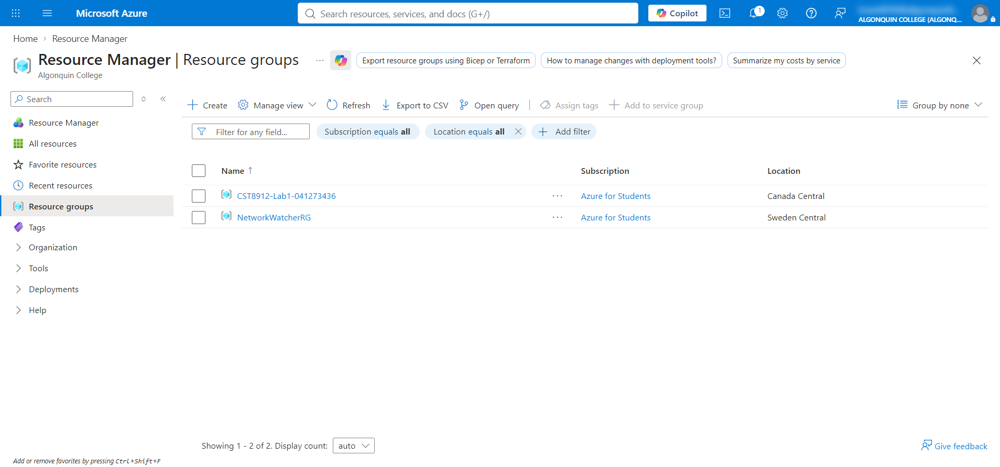
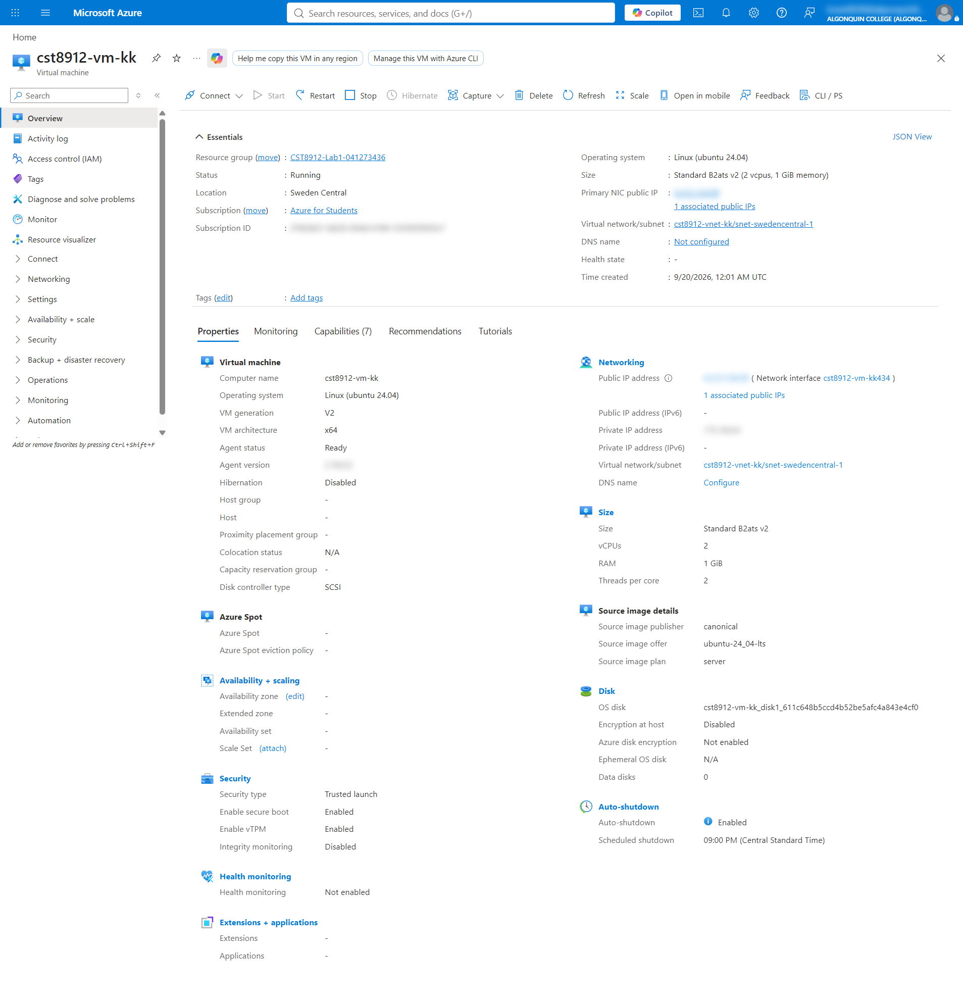
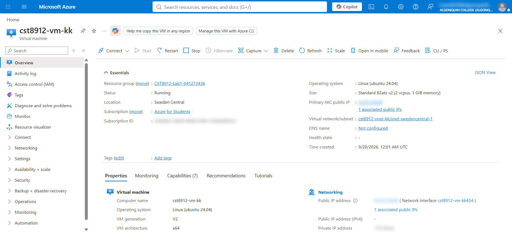
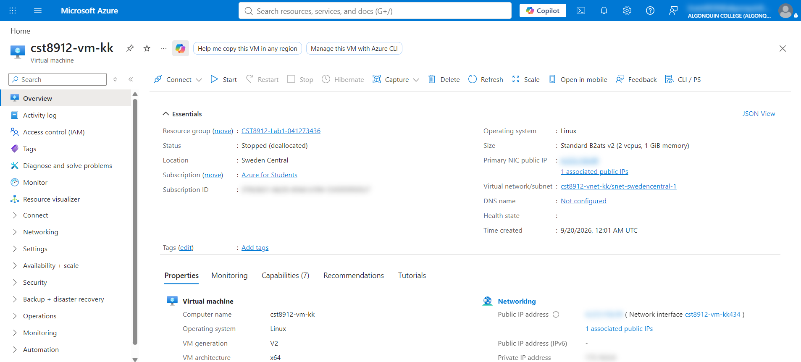

# CST8912 – Graded Lab Activity #1

## Student Information

- **Full Name :** Krami Kamal
- **Student Number :** 041273436
- **Lab title:** Provisioning and Managing an Azure Virtual Machine

---

There is no doubt that this lab helped me understand how to create and manage a virtual machine in Azure.

- **First,** I created a dedicated resource group for Lab 1, and I used it only for the resources of this lab.
- **Second,** I created the virtual machine cst8912-vm-kk inside this resource group, and the Overview page shows that its status is Running.
- **Third,** I stopped the virtual machine from the Azure portal, and the status changed to Stopped (deallocated), which means that the compute charges stopped.
- **To be more specific,** this is important for people who want to control their cost, because a machine that is only shut down inside Linux might stay allocated.
- **Overall,** given all these points, it is clear that the Azure portal makes it easy to create a resource group, deploy a virtual machine, and control its power state.

## Screenshots

**Resource group Overview page :**

**VM Overview page, status Running :**

**VM Overview page, status Running :**

**VM Overview page, status Stopped (deallocated) :**

